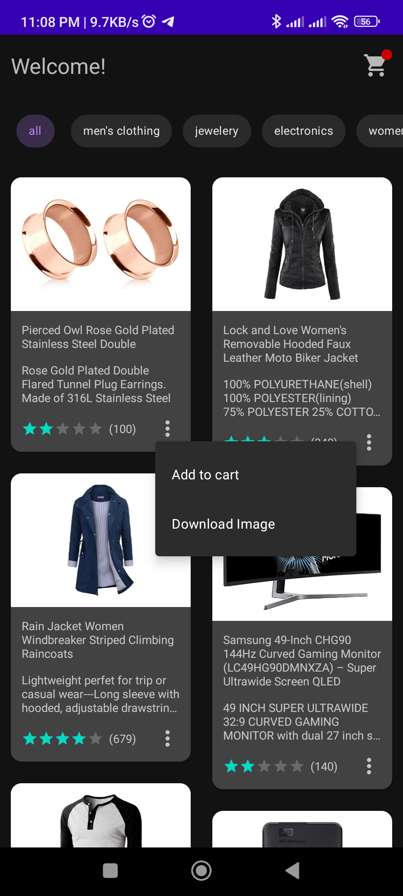
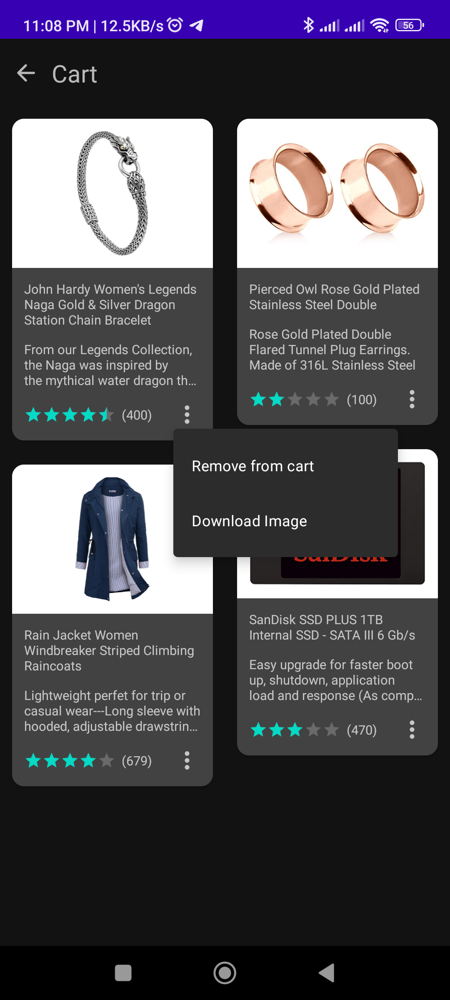

# Storedei

Storedei is an Store-like application for Juara Android submission.

User can view products, view their cart, add product to cart, remove product from cart, and download product image.

## Tech Stack

* Kotlin
* Coroutines
* Hilt
* MVVM Architecture
* Repository Architecture
* Retrofit
* Room
* Flow and LiveData
* WorkManager
* ConstraintLayout
* ViewBinding

## API
https://fakestoreapi.com/

## Preview

  
  

